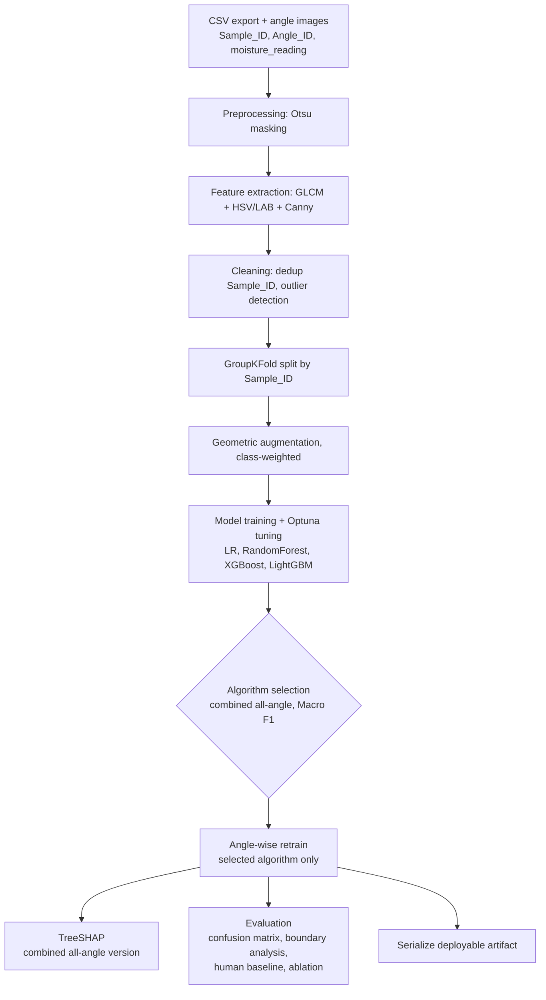

# Architecture — Copra Grading Pipeline

Source of truth: `../model-development-instructions.md`. This doc maps that spec's 11-step scope (§2) onto actual modules and describes data flow between them. Hard constraints live in `../CLAUDE.md`, not here.

## Pipeline stages

Note: TreeSHAP (J) runs against the combined all-angle version of the *selected* algorithm from stage H, not the angle-retrained deployment version from I — see §10 of the instructions doc. Evaluation (K) and serialization (L) operate on the angle-retrained deployment model from I.

## Module → spec section map

| Module (`src/copra_grading/`) | Spec section | Responsibility |
|---|---|---|
| `labels.py` | §1, §3 | Derive class 1/2/3 from `moisture_reading` at exact 6.0/6.1/14.0 boundaries |
| `preprocessing/otsu.py` | §4 | Otsu background masking; swappable interface for documented fallbacks (adaptive threshold, HSV mask, GrabCut) |
| `features/glcm.py` | §5a | Texture: contrast, homogeneity, energy, entropy at configured angles/distances |
| `features/color.py` | §5b | HSV + LAB per-channel statistics |
| `features/edges.py` | §5c | Canny edge/contour density |
| `features/combine.py` | §5 | Concatenate the three families into one per-angle-image feature row |
| `cleaning/dedup.py` | §6.1 | Resolve duplicate `Sample_ID` at merge/export time |
| `cleaning/outliers.py` | §6.2 | Z-score / IQR outlier flagging on extracted features (configurable, see ADR-001) |
| `splitting/groupkfold.py` | §7a | GroupKFold by `Sample_ID`, runs before augmentation |
| `augmentation/geometric.py` | §7b | Rotation/flip only, per-class multiplier (see ADR-002) |
| `models/{logreg,random_forest,xgboost_model,lightgbm_model}.py` | §8a | Four candidate models, all natively class-weighted |
| `models/tuning.py` | §8b | Optuna, optimizing Macro F1 (see ADR-003 for search space/budget) |
| `selection/algorithm_selection.py` | §8c step 1 | Combined all-angle training of all four; pick best ensemble by tuned Macro F1 |
| `selection/deployment_config.py` | §9 | Retrain *only* the selected algorithm across single-angle/angle-subset configs; determine minimal deployment input |
| `explainability/treeshap.py` | §10 | TreeSHAP on selected algorithm's combined all-angle version; aggregate by feature family; expose a callable for live per-image SHAP at deployment time |
| `evaluation/metrics.py` | §11 | Confusion matrix, accuracy, F1, per-class precision/recall, Macro F1 |
| `evaluation/boundary_analysis.py` | §11 | Near-boundary vs. mid-range bucketed metrics (see ADR-007 for tolerance band) |
| `evaluation/human_baseline.py` | §11 | Accepts human-labeled comparison file/column; compares model vs. manual pasa-method accuracy |
| `evaluation/ablation.py` | §11 | Color-only / texture-only / edge-only / combined accuracy progression |
| `evaluation/viz.py` | §11 | PCA / t-SNE sanity-check visualization of combined feature space |
| `artifact/serialize.py` | §12 | Bundle deployment model + preprocessing/feature-extraction config (Otsu params, GLCM angle/distance set, feature ordering) into one loadable artifact (see ADR-005) |

## Data flow

1. **Input** (§3): one CSV row per angle image (`Sample_ID`, `Angle_ID`, `timestamp`, `moisture_reading`) + images under a configurable root path. Six rows share one `Sample_ID`/moisture reading. Class label is computed, never read from a pre-populated column.
2. **Masking** (§4): each angle image → Otsu binary mask → masked image. All downstream feature extraction consumes only masked images.
3. **Feature extraction** (§5): masked image → one feature row (GLCM + HSV/LAB + Canny concatenated). Six images/sample → six rows before any angle-wise comparison.
4. **Cleaning** (§6): dedup at the `Sample_ID` level, then outlier flags on the extracted feature rows (not raw images — completeness is already guaranteed upstream by Jotter).
5. **Split → augment** (§7): GroupKFold by `Sample_ID` first, then geometric augmentation with per-class multipliers applied only within each fold's training data.
6. **Training + tuning** (§8): all four models, Optuna-tuned for Macro F1, all class-weighted.
7. **Selection** (§8c): combined all-angle comparison picks the deployable ensemble; LR is baseline-only.
8. **Angle-wise retrain** (§9): determines the actual deployment photo requirement — this result is a hard input to the final artifact, not just a reported number.
9. **Explainability** (§10): aggregate SHAP by feature family on the selected algorithm's combined all-angle version.
10. **Evaluation** (§11): full metric suite against the angle-retrained deployment model, including the human baseline and ablation study.
11. **Artifact** (§12): serialize the angle-retrained deployment model + its exact preprocessing/feature config — this is the only thing handed to the Streamlit layer, never the combined all-angle model.

## Placeholder data

If real field data isn't available yet, `scripts/make_synthetic_dataset.py` generates a schema-matching synthetic dataset (six angle images/sample, moisture column, three-class derivation) so the pipeline is provably wired end-to-end before real data lands (§15 closing note).
